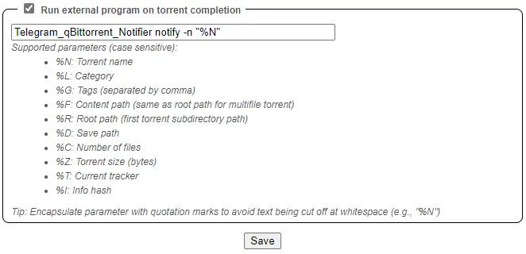

# Telegram_qBittorrent_Notifier

A simple CLI tool for qBittorrent that sends a message to Telegram on torrent completion.

## Quick Start

### Requirements

The first step requires you to obtain a valid Telegram API key (api_id and api_hash pair):

1. Visit https://my.telegram.org/apps and log in with your Telegram account.
2. Fill out the form with your details and register a new Telegram application.
3. Done. The API key consists of two parts: api_id and api_hash. Keep it secret.

### Installation

Download static binary file from [Releases](https://github.com/hydrotho/Telegram_qBittorrent_Notifier/releases/latest)
and add it to your `$PATH`.

### Init

When using this tool for the first time, you must execute the `init` command.

Execute `Telegram_qBittorrent_Notifier init` and just follow the prompt.

```shell
Usage: Telegram_qBittorrent_Notifier init [OPTIONS]

Options:
  --api-id API_ID                 Provide your telegram api_id.
  --api-hash API_HASH             Provide your telegram api_hash.
  -d, --working-directory WORKING_DIRECTORY
                                  Specify the working directory, where the
                                  Telegram session file should be saved.
  --help                          Show this message and exit.
```

When the initialization is complete, you will receive a greeting message in your Telegram's `Saved Message`.


### Use Telegram_qBittorrent_Notifier with qBittorrent

In your qBittorrent Web UI, open `Options`, go to the `Downloads` tab, scroll to the end and
find `Run external program on torrent completion`.



```shell
Usage: Telegram_qBittorrent_Notifier notify [OPTIONS]

Options:
  -n TORRENT_NAME
  -l CATEGORY
  -g TAGS
  -f CONTENT_PATH
  -r ROOT_PATH
  -d SAVE_PATH
  -c NUMBER_OF_FILES
  -z TORRENT_SIZE
  -t CURRENT_TRACKER
  -i INFO_HASH
  --help              Show this message and exit.
```

### Test

For test purpose, you can use the `send` command directly to send a specified message.

```shell
Telegram_qBittorrent_Notifier send "Hello World"

Usage: Telegram_qBittorrent_Notifier send [OPTIONS] [MESSAGE]

Options:
  --help  Show this message and exit.
```

## License

[GNU GPLv3](https://github.com/hydrotho/Telegram_qBittorrent_Notifier/blob/master/LICENSE)
